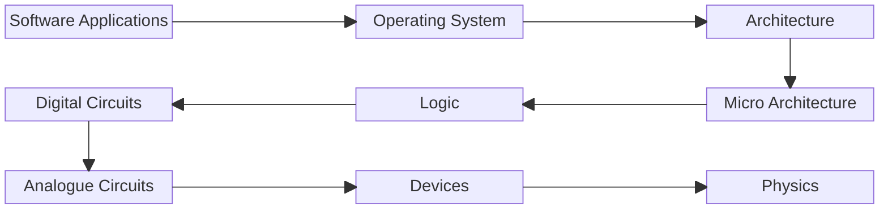

# The features and characteristics of different computer architecture models

## Learning Objectives

### Learners will be able to:

1. *Define* **computer architecture** and *describe* how it it relates to day to day tasks that they complete on a computer.
2. *List* examples of both **Complex Instruction Set Computer (CISC)** and **Reduced Instruction Set Computer (RISC)** architectures and *classify* an **architecture** based on a description.
3. *Demonstrate*, how factors such as the size of a **register** or the quantity of available **instructions** can influence the **performance** of an **architecture**.
4. *Compare* **CISC** and **RISC** architectures, *identifying* their respective strengths and compromises.

### Learners will aspire to:

5. *Select* an appropriate **architecture model**, based on the requirements of a given scenario.

## Outline

***ATTENTION***
*This outline may not completely match the current implementation.*

- This is a short session with a target delivery time of twenty minutes.
- The presentation should be kept brief to dedicate as much time to the activities as possible.
- The use of maths formulas in demonstrations sees maths well integrated into the session.
- English integration comes in the form of interpretation of the instructions in the demonstration, with the extension/takeaway scenarios providing further comprehension practice.

### 1. Starter activity - Picture Clues
Learners will try to match pictures to instruction set architectures they may have already heard of.
e.g. Intel x86, AMD64, Arm64, RISC-V.

### 2. Slides - Explanation of instruction sets and introduction to CISC & RISC
Diagram to show where architecture fits in in relation to other system components:



```
flowchart LR;
	A[Software Applications] --> B[Operating System];
	B --> C[Architecture];
```
```
flowchart LR;
	D[Micro Architecture] --> E[Logic];
	E[Logic] --> F[Digital Circuits];
```
```
flowchart LR;
	G[Analogue Circuits] --> H[Devices];
	H --> I[Physics];
```

Refer to software source code written in **programming languages** that get converted to **assembly languages** specific to the **instruction set**, or directly to the associated **machine code**.

**Machine code** that runs on the physical hardware. Discussions of architecture are focused on the **instruction set**, whereas **microarchitecture** goes into the lower level detail on how the architectures are implemented.

Describe how instruction sets are used to execute the **software code** on the **physical hardware**.

Describe how the **register** provides very fast access to values, compared to the extremely large, but slower to access, **memory**.

```Visual_Example

Show the difference between the 32 x 32 (1024) bits of a RISC-V register and the bits in of 8GB of RAM (64 billion), a farily modest amount for a modern PC.

Describe the resolution of screen you would need to show these side by side as a grid where the 1024 bits are represented in a single pixel.

This is not possible to render on any off the shelf screen. On a 4k screen, we can achieve it if we represent the ram in bytes instead, reducing the required size by a factor of 8. Even then, nearly the entire screen would be taken up by the ram.
```


```Practical_Example

	Get one learner to look up a value on a post-it note or index card.
	Get another to look up a value in a phone book / argos catalogue or similar.
```

Describe how instructions need to be executed between the ticks of the **clock signal**.

Introduce Complex Instruction Set Computer (CISC) architecture and Reduced Instruction Set Computer (RISC) architecture and explain differences in terms of quantity and complexity of instructions.

### 3. Discussion - Impact of RISC

- How do we think having fewer, more simple instructions impacts performance of a machine?
	- Shorter instructions allow clock speed to be increased.

- How do we think this impacts programmers?
	- Point out that decades ago, far more programs were directly written in assembly code, so having more complex instruction sets would have made programming more simple.
	- Today, we predominantly work in higher level program languages and compilers and interpreters convert everything to assembly code for us.
	- Even operating systems are these days are written in higher level programming languages compared to the millions of lines of assembly code of early OS's.
		Windows is written in C++ with the kernel in C. Linux is a mix of C & C++, and even some Python. The kernel is C with a very small amount written in assembly code.

### 4. Slide - Hennessy & Patterson Architecture Design Principles

	1. Simplicity favours regularity
	2. Make the common case fast
	3. Smaller is faster
	4. Good design demands good compromises
### 5. Demonstration - Complex instructions and higher clock speeds

Learners will race to complete instructions between two signals, the time between them decreasing. The complex instructions will become harder and harder to execute.

### 6. Quiz - Stomp/Clap

True/False quiz covering lesson content.
### 7. Extension/Takeaway Activity - Scenarios

Worksheet with some scenarios. Learner should list some considerations to make in selecting/designing a suitable architecture for the use case.
## Assessment
### Informal/Formative

- Learner involvement in demonstrations will provide an opportunity to demonstrate understanding.
- Quiz at the end of the session will cover the main learning objectives.
- Worksheet from extension/takeaway activity will cover aspirational objective.
## Resources

### Essential

- **Presentation**
	For delivery on TV/interactive whiteboard, Open Document Format (.odp),  Open Office XML Presentation (.pptx), or PowerPoint (.ppt)
- **Instruction cards, timer and calculators**
	For reduced vs complex instruction card demonstration.
		Instructions could be mathematical formulas, broken down for RISC, and in full for CISC.
			Ordering of the formula should be such that it is difficult to quickly type into a calculator.
		Timer can be integrated into presentation.
		Learners can use calculators on phones.
- **Extension/takeaway worksheet**
	Sheet can be marked by tutor on return, or marking criteria included for self-assessment.
### Optional

- **Picture clues worksheets**
	The pictures should be in the presentation but worksheets will provide material for future reference.
- **Post-it notes/index cards & phonebook or catalogue**
	For register vs memory demo.
		Helps to reinforce access time differences between values held in the register and values held in memory.
- **Quiz sheets**
	Quiz to be delivered via presentation, but sheets can provide material for future reference.
- **Glossary of terms**
	Provides materials for future reference. Learners should be encouraged to transcribe their own definitions into a larger glossary that they maintain for their course.
